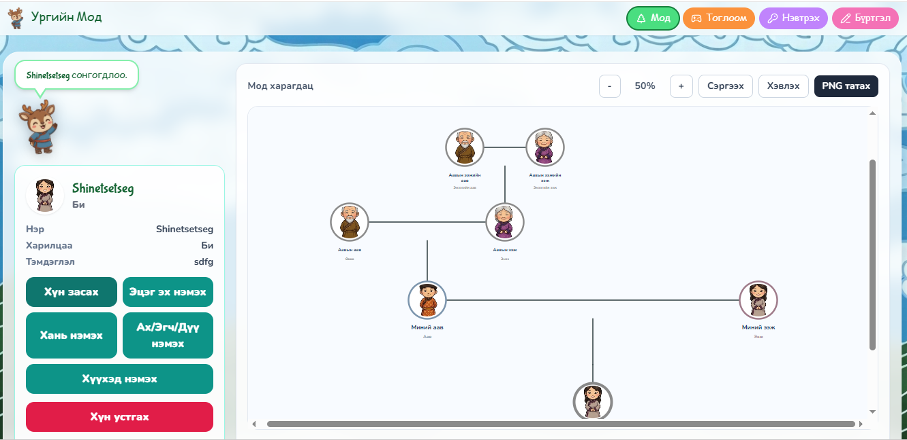

# Urgiinmod

<p align="center">
  
</p>

## Төслийн тухай

**Urgiinmod** нь **Laravel framework** ашиглан хөгжүүлсэн web application юм.  
Энэхүү project нь мэдээллийг цэгцтэй хадгалах, удирдах, хэрэглэгчдэд ойлгомжтой байдлаар харуулах зорилготой.

## Ашигласан technologies

- Laravel
- PHP
- Blade
- MySQL
- HTML / CSS
- JavaScript
- Tailwind CSS
- Vite
- Composer
- NPM

## Үндсэн features

- User-friendly web interface
- Laravel routing болон controller structure
- Database-тэй ажиллах боломж
- Blade template ашигласан pages
- Organized project folder structure
- Responsive design
- Frontend assets-ийг Vite ашиглан build хийх

## Энэ project дээр сурсан зүйл

Энэ project дээр ажиллах явцдаа **Laravel web application** бүтээх үндсэн ойлголтуудыг сурсан.  
Үүнд **routes**, **controllers**, **Blade templates**, **database connection**, **migration**, **frontend assets**, мөн **Tailwind CSS** болон **Vite** ашиглах чадварууд багтсан.

Мөн project-ийн folder structure-ийг зөв зохион байгуулах, backend болон frontend хэсгийг холбож ажиллуулах, web application-ийг илүү цэгцтэй хөгжүүлэх туршлага gained.

## Installation

```bash
git clone https://github.com/Signet61/Urgiinmod.git
cd Urgiinmod
composer install
npm install
cp .env.example .env
php artisan key:generate
php artisan migrate
npm run dev
php artisan serve